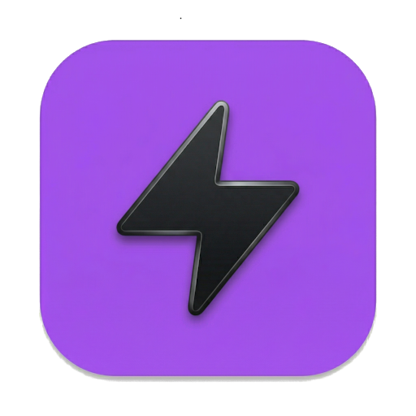

<p align="center">
  
</p>

<h1 align="center">⚡ UltraRPC</h1>

<p align="center">
  <em>A premium desktop API client for <strong>REST</strong> and <strong>gRPC</strong> — built with Electron, React, and TypeScript.</em>
</p>


---

## 🎯 Overview

UltraRPC is a cross-platform desktop application designed for developers who need a single tool to test and debug both REST APIs and gRPC services. Unlike cloud-based alternatives, UltraRPC stores everything locally in human-readable files — no accounts, no subscriptions, no data leaving your machine.

### Why UltraRPC?

| Challenge | UltraRPC Solution |
|-----------|-------------------|
| Need separate tools for REST and gRPC | Unified interface with one-click REST/gRPC toggle |
| gRPC proto files are tedious to manage | **Server Reflection** auto-discovers services and methods |
| API collections locked in proprietary clouds | File-per-request storage — commit to git, share as folders |
| CORS blocks browser-based API clients | Electron's Node.js backend bypasses CORS entirely |
| No auto-generated request payloads | Reflection parses proto descriptors to generate sample JSON bodies |
| Cryptic gRPC errors | **Rich Error Unpacking** decodes binary trailers (`grpc-status-details-bin`) |

---

## ⚡ Quick Start Guide

New to UltraRPC? Here is how to get up and running in 60 seconds.

### 1. Create a Collection
- In the sidebar, click the **+** icon next to "COLLECTIONS".
- Give it a name (e.g., `My App`). This creates a local folder on your machine.
- Your requests will be saved as human-readable `.json` files inside this folder.

### 2. Set Up Environments
- Click the **Globe** icon in the bottom left to open the Environment Panel.
- Use the **+** button to create a new environment (e.g., `Staging`).
- Add keys like `BASE_URL` or `API_KEY`.
- Select your active environment from the dropdown near the address bar.

### 3. Build Your First Request
- Click the **+** in the top tab bar to open a fresh tab.
- Choose **REST** or **gRPC** using the toggle in the address bar.
- **REST**: Enter your URL and use the **Params** or **Headers** tabs. Reference variables like `{{BASE_URL}}/users`.
- **gRPC**: 
  - Enter the host (e.g., `localhost:50051`).
  - Click **Discover Services** (Reflection) to see available methods.
  - Click **Use →** to auto-scaffold a request body in the **Body** tab.

### 4. Variables & Scripting
- **Resolution**: UltraRPC resolves `{{variable}}` by checking your **Collection Variables** first, then your **Active Environment**.
- **Post-Response Scripts**:
  - Go to the **Script** tab in any request.
  - Write standard JavaScript to extract data: `const id = ultra.response.body.id;`.
  - Save it for the next request: `ultra.setCollectionVariable('userId', id);`.
- Use the **Script Console** at the bottom of the tab to debug with `console.log()`.

---

## ✨ Features

### 🌐 REST Client
- Full HTTP method support — **GET**, **POST**, **PUT**, **DELETE**, **PATCH**
- Key-value editors for **query parameters** and **headers** with enable/disable toggles
- JSON and plain text body editor with **syntax highlighting** and **variable interpolation**
- Formatted JSON response viewer with syntax highlighting
- Status codes, response time, and size metrics
- One-click copy response to clipboard

### ⚡ gRPC Client
- Native gRPC support via `@grpc/grpc-js` — no CLI tools or Docker needed
- **Server Reflection** — auto-discover services and methods without proto files
- **Server Streaming Support** — transparently collects streamed responses into a formatted array
- **Rich Error Unpacking** — decodes `google.rpc.Status` trailers to show human-readable field validation errors
- **Variable Interpolation** — use `{{variable}}` syntax in gRPC headers, URL, and **Request Payloads**
- **Deadlines / Timeouts** — configure native gRPC deadlines in the "Options" tab
- **Auto-generated sample request bodies** — generated from protobuf descriptors via reflection

### 📁 Collections & Variables
- **File-based storage** — each collection is a folder, each request is a `.json` file
- **Collection-Level Variables** — define variables scoped specifically to a collection
- **Hierarchical Resolution** — Variables are resolved with priority: `Collection > Environment`
- **Import/Export** — Support for `.ultrarpc.json` archives and opening any local folder as a collection

### 🤖 Scripting & Automation
- **Post-Response Scripts** — Write JavaScript code to run after any request
- **The `ultra` Object**:
  - `ultra.response`: Access status, headers, and parsed JSON body
  - `ultra.setCollectionVariable(key, value)`: Chain requests by saving response data to the collection
- **Script Console**: Integrated log viewer for `console.log()` and `console.error()` calls within scripts

### 🎨 Premium UI
- **Resizable Split Layout**: Independent scrolling for request config and response viewer
- **Unsaved Changes Tracking**: Visual indicators for modified tabs and native "Abandon changes?" prompts
- **Theme Support**: Midnight (Dark) and Daylight (Light) modes with glassmorphism effects
- **Reset Layout**: One-click recovery from extreme window/pane resizing in Global Settings

---

## 🚀 Getting Started

### Prerequisites

| Requirement | Version |
|-------------|---------|
| [Node.js](https://nodejs.org/) | v18 or higher |
| npm | v9 or higher (ships with Node.js) |

### Install & Run

```bash
# Clone the repository
git clone <your-repo-url>
cd UltraRPC

# Install dependencies
npm install

# Start in development mode (Electron + Vite HMR)
npm run dev
```

The Electron app will launch automatically with hot module replacement enabled.

---

## 📂 Project Structure

```
UltraRPC/
├── electron/                        # Electron main process (Node.js)
│   ├── main.ts                      # App entry: window creation, IPC registration
│   ├── preload.ts                   # Context bridge: exposes safe IPC API to renderer
│   ├── rest-handler.ts              # HTTP/HTTPS request handler (Node native)
│   ├── grpc-handler.ts              # gRPC reflection, streaming, and unary calls
│   └── storage-handler.ts           # Filesystem: collections, history, environments, settings
│
├── src/                             # React renderer process
│   ├── App.tsx                      # Root component: tabs, request lifecycle, script execution
│   ├── main.tsx                     # React DOM entry point
│   ├── index.css                    # Global CSS: design system, dark theme, split-pane layout
│   ...
```

---

## 🏛 Architecture

### IPC Communication (window.ultraRpc.*)

| Channel | Direction | Purpose |
|---------|-----------|---------|
| `rest:send` | Renderer → Main | Execute HTTP/HTTPS request |
| `grpc:reflect` | Renderer → Main | List gRPC services via reflection |
| `grpc:methods` | Renderer → Main | Get methods with sample bodies |
| `grpc:call` | Renderer → Main | Execute gRPC call (Unary or Streaming) |
| `storage:listCollections` | Renderer → Main | List saved collection folders |
| `storage:saveSettings` | Renderer → Main | Persist theme/active environment selection |
| `storage:getSettings` | Renderer → Main | Load app-wide preferences |
... (and 15+ other channels for variables, collections, and history)

---

## 🗺 Roadmap

- [x] Server side gRPC streaming support
- [x] Request scripting (Post-response)
- [x] Collection Variables
- [x] Rich gRPC error decoding
- [ ] TLS/SSL configuration panel for gRPC (Client Certificates)
- [ ] WebSocket support
- [ ] GraphQL support
- [ ] Pre-request scripts
- [ ] Response diffing
- [ ] Plugin system

---

## 📄 License

MIT
