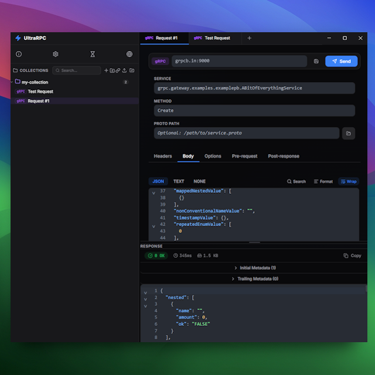
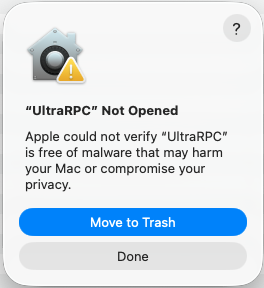
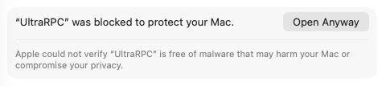
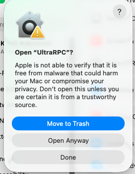
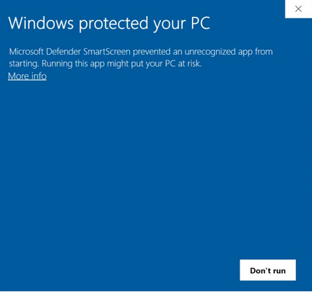
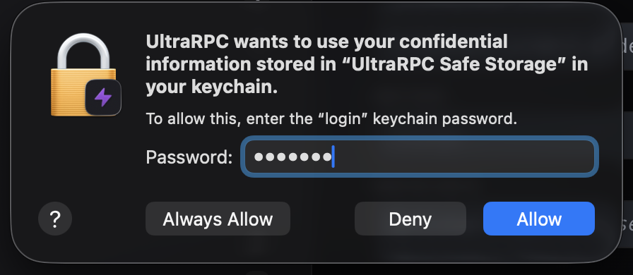

<p align="center">
  
</p>

<h1 align="center">UltraRPC</h1>

<p align="center">
  <em>A lightweight desktop API client for <strong>gRPC</strong> and <strong>REST</strong> — built with Electron, React, and TypeScript.</em>
</p>


---

## 🎯 Overview

<p align="center">
  
</p>


UltraRPC is a cross-platform desktop application designed for developers who need a single tool to test and debug both REST APIs and gRPC services. Unlike cloud-based alternatives, UltraRPC stores everything locally in human-readable files — no accounts, no subscriptions, no data leaving your machine.

### Why UltraRPC?

| Challenge | UltraRPC Solution |
|-----------|-------------------|
| Need separate tools for REST and gRPC | Unified interface with one-click REST/gRPC toggle |
| gRPC proto files are tedious to manage | **Server Reflection** auto-discovers services and methods |
| API collections locked in proprietary clouds | File-per-request storage — commit to git, share as folders |
| CORS blocks browser-based API clients | Electron's Node.js backend bypasses CORS entirely |
| No auto-generated request payloads | Reflection parses proto descriptors to generate sample JSON bodies |
| Cryptic gRPC errors | **Rich Error Unpacking** decodes binary trailers (`grpc-status-details-bin`) |

---

## ⚡ Quick Start Guide

New to UltraRPC? Here is how to get up and running in 60 seconds.

### 1. Create a Collection
- In the sidebar, click the **+** icon next to "COLLECTIONS".
- Give it a name (e.g., `My App`). This creates a local folder on your machine.
- Your requests will be saved as human-readable `.json` files inside this folder.

### 2. Set Up Environments
- Click the **Globe** icon in the bottom left to open the Environment Panel.
- Use the **+** button to create a new environment or the **Import** button to load a Postman environment file.
- Add keys like `BASE_URL` or `API_KEY`.
- **Selective Enabling**: Use the checkboxes next to each variable to quickly enable or disable it without deleting the entry.
- **Protocol Selection**: Choose between **Auto**, **HTTP/1.1**, and **HTTP/2** specifically for the outgoing requests in this environment.
- **SSL Toggle**: Disable SSL verification for development environments with self-signed certificates.

- **Per-Tab Selection**: Select an environment from the dropdown near the address bar. This selection is **specific to the current tab**, allowing you to work across different environments simultaneously.
- **Inheritance**: New tabs automatically inherit the currently active global environment.
- **Zero-Footprint Selection**: Environment selections are considered session-level UI state—they do **not** mark requests as "dirty" and are **never** persisted into collection `.json` files, ensuring your shared collections remain environment-agnostic.
- **Secrets Vault**: Each environment has a dedicated **Vault** section for sensitive data (API keys, tokens). Data is encrypted using native OS security and is never stored in plain text or exported.

### 3. Build Your First Request
- Click the **+** in the top tab bar to open a fresh tab.
- Choose **REST** or **gRPC** using the toggle in the address bar.
- **REST**: Enter your URL and use the **Params** or **Headers** tabs. Reference variables like `{{BASE_URL}}/users`.
- **gRPC**: 
  - Enter the host (e.g., `localhost:50051`).
  - Click **Discover Services** (Reflection) to see available methods.
  - Click **Use →** to auto-scaffold a request body in the **Body** tab.

### 4. Variables & Scripting
- **Resolution**: UltraRPC resolves `{{variable}}` by checking your **Collection Variables** first, then your **Active Environment**.
- **Ultra Object**: UltraRPC provides a global `ultra` object for custom logic:
  - **Pre-request Scripts**: Run before the request is sent to set dynamic variables or calculate signatures.
  - **Post-response Scripts**: Run after a response is received to perform assertions or extract data.
- **Example**:
  ```javascript
  // Pre-request: Set a timestamp
  ultra.env.set("timestamp", Date.now().toString());

  // Post-response: Validate status and save a token
  ultra.expect(ultra.response.status).toBe(200);
  if (ultra.response.body.token) {
    ultra.collection.set("auth_token", ultra.response.body.token);
  }
  ```
- Use the **Script Console** at the bottom of each script tab to debug with `console.log()`.

---

## ✨ Features

### 🌐 REST Client
- Full HTTP method support — **GET**, **POST**, **PUT**, **DELETE**, **PATCH**
- **Protocol Selection** — Choose between **HTTP/1.1** and **HTTP/2** (with ALPN/Auto support)
- Key-value editors for **query parameters** and **headers** with enable/disable toggles
- JSON and plain text body editor with **syntax highlighting** and **variable interpolation**
- Formatted JSON response viewer with syntax highlighting
- Status codes, response time, and size metrics
- One-click copy response to clipboard

### ⚡ gRPC Client
- Native gRPC support via `@grpc/grpc-js` — no CLI tools or Docker needed
- **Server Reflection** — auto-discover services and methods without proto files
- **Server Streaming Support** — transparently collects streamed responses into a formatted array
- **Rich Error Unpacking** — decodes `google.rpc.Status` trailers to show human-readable field validation errors
- **Variable Interpolation** — use `{{variable}}` syntax in gRPC headers, URL, and **Request Payloads**
- **Deadlines / Timeouts** — configure native gRPC deadlines in the "Options" tab
- **Auto-generated sample request bodies** — generated from protobuf descriptors via reflection

### 📁 Collections & Variables
- **File-based storage** — each collection is a folder, each request is a `.json` file
- **Native Recursive Folders** — support for deeply nested folder structures with drag-and-drop reordering and context menu management (Rename/Delete/New Folder). **Note**: Renaming a folder physically moves the directory on your disk and must follow standard OS-level filename rules (no forbidden characters like `/`, `\`, `:`, etc.).
- **Collection-Level Variables** — define variables scoped specifically to a collection
- **Hierarchical Resolution** — Variables are resolved with priority: `Vault > Collection > Environment`
- **Per-Tab Environments** — Associate specific environments with individual request tabs. Tab 1 can be "Production" while Tab 2 is "Staging", with automatic inheritance for new tabs. This selection is **session-only** and does not trigger unsaved change warnings.
- **Selective Variable Enabling** — Checkboxes in the Environment Panel allow you to selectively disable variables during interpolation.
- **Postman Import** — Seamlessly import Postman v2.1 collections. Recursive folder structures are preserved, and scripts (`prerequest`/`test`) are automatically converted to UltraRPC syntax.
- **Bruno Import** — Import `.yml` or `.json` Bruno collections. Supports multi-protocol requests (REST + gRPC), automatic script conversion (`bru.*` -> `ultra.*`), and extracts environment variables and secret vault entries.
- **Secrets Vault (Encrypted)**: Store sensitive keys (e.g., `STRIPE_KEY`, `SESSION_TOKEN`) in a per-environment vault.
    - **Native Encryption**: Uses Electron's `safeStorage` (Keychain on macOS, DPAPI on Windows) to encrypt data at rest.
    - **Isolation**: Vault files are stored separately from collections and are excluded from all exports.
    - **Masking**: Values are masked in the UI and only revealed during active editing.
    - **Highest Priority**: Vault keys override Collection and Environment variables of the same name.
- **Import/Export** — Support for `.ultrarpc.json` archives and opening any local folder as a collection

### 🤖 Scripting & Automation
UltraRPC features a powerful scripting engine that allows you to automate workflows and validate responses using JavaScript.

#### The `ultra` Object API
The `ultra` object is available in both pre-request and post-response scripts.

| Namespace | Method | Description |
|-----------|--------|-------------|
| **Environment** | `ultra.env.get(key)` | Returns the value of an environment variable. |
| | `ultra.env.set(key, value)` | Sets/updates an environment variable. |
| | `ultra.env.all()` | Returns all enabled environment variables as an object. |
| **Collection** | `ultra.collection.get(key)` | Returns the value of a collection variable. |
| | `ultra.collection.set(key, value)` | Sets/updates a collection variable. |
| | `ultra.collection.all()` | Returns all enabled collection variables as an object. |
| **Globals** | `ultra.globals.get(key)` | Returns the value of a global variable. |
| | `ultra.globals.set(key, value)` | Sets/updates a global variable. |
| | `ultra.globals.all()` | Returns all enabled global variables as an object. |
| **Assertions** | `ultra.expect(val).toBe(exp)` | Strict equality check (`===`). |
| | `ultra.expect(val).toInclude(str)`| Partial string match. |
| | `ultra.expect(val).toBeTruthy()` | Checks if value is non-falsy. |
| **Network** | `ultra.sendRequest(req, cb)` | Sends an async HTTP request. `req` can be a URL string or object. |

#### Response Metadata (Post-Response Only)
In post-response scripts, the `ultra.response` object contains the full result:
- `ultra.response.status`: HTTP/gRPC status code.
- `ultra.response.body`: The response body (automatically parsed to JSON if applicable).
- `ultra.response.headers`: Response headers (object).
- `ultra.response.responseTime`: Request duration in milliseconds.

#### Chaining Requests
You can use `ultra.sendRequest` to chain multiple APIs together:
```javascript
ultra.sendRequest({
  url: "https://api.example.com/login",
  method: "POST",
  headers: { "Content-Type": "application/json" },
  body: JSON.stringify({ user: "admin" })
}, (err, res) => {
  if (!err && res.status === 200) {
    const token = res.json().access_token;
    ultra.env.set("auth_token", token);
    console.log("Token updated successfully!");
  }
});
```

### 📚 Code Library
Manage reusable JavaScript scripts that can be shared across all your API requests.
- **Project-Wide Utilities**: Register helper functions on `ultra.lib` to use them in any pre-request or post-response script.
- **File-Based**: Scripts reside as independent `.js` files on your disk. You can create new ones or link existing logic from your local file system.
- **Renaming Scripts**: You can rename scripts directly in the UI. **Note**: Renames must follow standard OS-level filename rules (no forbidden characters like `/`, `\`, `:`, etc.) as they physically move the file on your disk.
- **Selective Loading**: Use the checkboxes in the library to enable or disable specific scripts as needed.
- **Real-Time Execution**: Every time you send a request, your enabled library scripts are executed before your main script, populating the `ultra.lib` object.
- **Example**:
  ```javascript
  // Library Script: utils.js
  ultra.lib.hash = (str) => {
    return btoa(str); // Simple example
  };

  // Pre-request Script:
  const authHeader = ultra.lib.hash("user:pass");
  ultra.env.set("auth", authHeader);
  ```

### 🎨 Premium UI
- **Resizable Split Layout**: Independent scrolling for request config and response viewer
- **Three-Column View**: Toggle a side-by-side layout (Request vs Response) in Settings for better visibility on wide monitors.
- **Unsaved Changes Tracking**: Visual indicators for modified tabs and native "Abandon changes?" prompts
- **Theme Support**: Midnight (Dark) and Daylight (Light) modes with glassmorphism effects
- **Reset Layout**: One-click recovery from extreme window/pane resizing in Global Settings

---

## 🧠 Deep Dive: How gRPC Works

UltraRPC is designed to make gRPC testing as seamless as REST by handling the complexities of Protobuf serialization and schema management automatically.

### 🔄 Dynamic Reflection
Unlike other clients that require you to manually manage `.proto` files, UltraRPC uses **gRPC Server Reflection** by default.
- **Always Up-to-Date**: Schemas are fetched from the server's reflection endpoint for **every discovery and call**. If you change your Protobuf definition and restart your server, UltraRPC picks up the changes immediately without a restart.
- **On-the-Fly Parsing**: Descriptors are parsed into a virtual type system in memory, allowing for instant method discovery and sample body generation.

### 🪄 Smart JSON Mapping
Standard Protobuf serialization can be rigid. UltraRPC includes a "Scaffold & Adapt" layer that allows you to write natural JSON while meeting strict Protobuf requirements:
- **Map Handling**: Automatically converts standard JSON objects into the `entry[]` format required by Protobuf maps.
- **Well-Known Types**: Transparently handles `google.protobuf.Timestamp` (from ISO-8601 strings), `google.protobuf.Duration` (from "30s" style strings), and value wrappers (`StringValue`, `BoolValue`, etc.).
- **Fuzzy Lookup**: Matches JSON keys to Protobuf fields using a case-insensitive, dash/underscore-ignoring algorithm, so you don't have to worry about `camelCase` vs `snake_case` mismatches.

### 🛡️ Local-First Proto Support
If your server doesn't support reflection, you can provide a path to a local `.proto` file in the "Options" tab. UltraRPC reads this file directly from your disk, ensuring your private definitions never leave your machine.

---

## 🚀 Getting Started

### Prerequisites

| Requirement | Version |
|-------------|---------|
| [Node.js](https://nodejs.org/) | v18 or higher |
| [Bun](https://bun.sh/) | v1.x or higher |

### Install & Run

```bash
# Clone the repository
git clone <your-repo-url>
cd UltraRPC

# Install dependencies
bun install

# Start in development mode (Electron + Vite HMR)
bun run dev
```

The Electron app will launch automatically with hot module replacement enabled.

---

## 📦 Distribution & Packaging

UltraRPC uses `electron-builder` to create native installers for all major platforms. All build artifacts are output to the `release/` directory.

### 🍎 macOS
Builds a universal DMG for Apple Silicon and Intel Macs.
```bash
bun run package:mac
```
- **Output**: `release/UltraRPC-1.0.0-arm64.dmg` (or similar)
- *Note: On macOS, this also generates a `.app` bundle in `release/mac-arm64/`.*

### 🪟 Windows
Generates a standard NSIS installer.
```bash
bun run package:win
```
- **Output**: `release/UltraRPC-Setup-1.0.0.exe`
- **Feature**: Supports custom installation paths and desktop shortcuts.

### 🐧 Linux
Creates a portable AppImage that runs on most distributions.
```bash
bun run package:linux
```
- **Output**: `release/UltraRPC-1.0.0.AppImage`


---

## 🧪 Testing

We use [Playwright](https://playwright.dev/) for End-to-End (E2E) testing. The tests launch a real Electron instance to verify all critical user flows:
- **REST**: GET/POST/PUT/DELETE, JSON body formatting, headers/params, and request timeouts.
- **gRPC**: Server reflection discovery, local `.proto` file support, unary, and server-streaming calls.
- **Collections**: Full CRUD lifecycle, search/filtering, folder support, and Postman v2.1 import.
- **Environments**: Variable interpolation, SSL/TLS toggles, HTTP protocol selection, and Postman import.
- **State**: Tab persistence, config tab memory, and dark/light theme persistence.

> [!IMPORTANT]
> **Build Prerequisite**: Because E2E tests target the built application, you **must** run `bun run build` at least once before running tests.

### 1. Run Tests (Headless)
Run the entire suite in your terminal:
```bash
# Run all tests (automatically builds the app)
bun run test:e2e

# Run a specific test file
npx playwright test tests/e2e/rest-flow.spec.ts
```

### 2. UI Mode (Debug)
Launch the interactive test runner to see the app in action and debug step-by-step:
```bash
# Open UI mode for all tests
npx playwright test --ui

# Open UI mode for a specific test file
npx playwright test tests/e2e/environment-workspace.spec.ts --ui
```

### 3. Trace Viewer
If a test fails, you can view the recorded trace for deep debugging:
```bash
npx playwright show-trace test-results/<test-directory>/trace.zip
```

### 4. Linting & Type Checking
To view code quality warnings and TypeScript errors locally (like the ones caught by GitHub Actions), use:
```bash
# Run ESLint to check for React Hooks and code style issues
bun run lint

# Run the TypeScript compiler to catch type errors without building
npx tsc --noEmit
```

> [!NOTE]
> Tests are isolated and use a temporary `test-user-data` directory which is automatically cleared to ensure consistency across runs.

---


## 🛡️ Running Unsigned Applications


Since UltraRPC is not yet code-signed with Apple or Microsoft developer certificates, your OS may block it by default. Here is how to run it anyway:

### 🍎 macOS ("Open Anyway")

Since UltraRPC is not currently code-signed with an Apple Developer certificate, macOS will block it by default with a "Malicious Software" warning. Follow these steps to grant an exception:

1.  **Initial Warning**: When you first try to open **UltraRPC.app** from your Applications folder, you will see a dialog stating it cannot be opened because the developer cannot be verified. Click **Done**.
    <p align="center">
      
    </p>

2.  **Open Privacy Settings**: Go to **System Settings > Privacy & Security**. 
    <p align="center">
      
    </p>

3.  **Click Open Anyway**: Scroll down to the "Security" section. You will see a message about UltraRPC being blocked. Click the **Open Anyway** button.
    <p align="center">
      
    </p>

4.  **Confirm Open**: A final confirmation dialog will appear. Click **Ope anyway** to launch the application and confirm with password. You will only need to do this once for new version installed.
    <p align="center">
      
    </p>

### 🪟 Windows ("Run Anyway")
When you run the installer, Windows SmartScreen may show a "Windows protected your PC" blue window.
1. Click the **More info** link under the main text.
2. A new button **Run anyway** will appear. Click it to proceed with the installation.
    <p align="center">
          
    </p>

### 🪟 Vault access

The first time you try to access the vault, you will be prompted to grant access to the secure storage. You can chose either **Always Allow**, **Allow** or **Deny**. If you choose **Deny**, you will not be able to access the vault.

    <p align="center">
      
    </p>

---

## 🗺 Roadmap

### 🌐 REST Client
- [ ] **Form-Data support** (Sending `multipart/form-data` with files/fields)
- [ ] **Binary body support** (Raw data or file upload)
- [ ] **Auth Helpers** (Dedicated UI for Basic/Bearer auth)
- [ ] **Cookies support** (Cookie manager and persistence)
- [ ] **WebSocket & GraphQL support**

### ⚡ gRPC Client
- [ ] **Metadata (Headers) Helpers** (Dedicated UI for common gRPC metadata)

### 📁 Collections & Management
- [ ] **Collection Runner** (Sequence execution with summary reports)

### 🤖 Scripting & Variables
- [ ] **Visual Test Results** (Dedicated UI for assertion summaries)
- [ ] **Built-in JS Libraries** (CryptoJS for HMAC/SHA signing, ajv for JSON Schema)
- [ ] **Dynamic Variables** (Support for `{{$guid}}`, `{{$timestamp}}`, and `{{$randomInt}}`)
- [ ] **Local Variables** (`ultra.variables` for temporary request-level context)
- [ ] **Response Visualizers** (Custom HTML/CSS rendering for data visualization)
- [ ] **Workflows** (`ultra.setNextRequest` for collection runner logic)

### 🎨 UX & Reliability
- [ ] **Global Search** (Searching across history, and tabs)
- [ ] **Response Diffing** (Compare two different responses visually)
- [ ] **Large Response Handling** (Optimized rendering for 10MB+ JSON payloads)
- [ ] **Code Generation** (Copy request as cURL, Fetch, or Python code)

---

## 📄 License

MIT https://mit-license.org/
